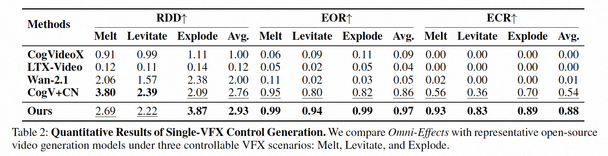

# *Omni-Effects*: Unified and Spatially-Controllable Visual Effects Generation

[](https://arxiv.org/abs/2508.07981)
[](https://amap-ml.github.io/Omni-Effects.github.io/)
[](https://huggingface.co/datasets/GD-ML/Omni-VFX)
[](https://huggingface.co/GD-ML/Omni-Effects)

# 🔥 Updates

- [2025/08] We release the CogVideoX-1.5 finetuned on our Omni-VFX dataset !
- [2025/08] We release the controllable single-VFX/Multi-VFX version of Omni-Effects!

# 📣 Overview

<table border="0" style="width: 100%; text-align: left; margin-top: 20px;">
  <tr>
      <td>
          <video src="https://github.com/user-attachments/assets/0e35c01d-dd66-4e46-af1a-1b15fa058711" width="100%" controls autoplay loop></video>
      </td>
      <td>
          <video src="https://github.com/user-attachments/assets/634bda8b-4b92-478e-9cba-cb6934fe3183" width="100%" controls autoplay loop></video>
      </td>
       <td>
          <video src="https://github.com/user-attachments/assets/71b071e8-4190-4eb4-beab-f39f945d7433" width="100%" controls autoplay loop></video>
     </td>
      <td>
          <video src="https://github.com/user-attachments/assets/a61d19a2-d1d4-4a84-8e2d-83fd3e646652" width="100%" controls autoplay loop></video>
     </td>
  </tr>
  <tr>
      <td>
          <video src="https://github.com/user-attachments/assets/711f36cf-c195-4814-b3a3-5eb57e24cb82" width="100%" controls autoplay loop></video>
      </td>
      <td>
          <video src="https://github.com/user-attachments/assets/55c4ac33-9578-4336-920c-e52d85307fb1" width="100%" controls autoplay loop></video>
      </td>
       <td>
          <video src="https://github.com/user-attachments/assets/94c9fd99-7e5f-4a4a-9c26-3b4165bbee75" width="100%" controls autoplay loop></video>
     </td>
      <td>
          <video src="https://github.com/user-attachments/assets/66e51762-46a6-416f-9e04-7025b6be3f0a" width="100%" controls autoplay loop></video>
     </td>
  </tr>
</table>


Visual effects (VFX) are essential visual enhancements fundamental to modern cinematic production. Although video generation models offer cost-efficient solutions for VFX production, current methods are constrained by per-effect LoRA training, which limits generation to single effects. This fundamental limitation impedes applications that require spatially controllable composite effects, i.e., the concurrent generation of multiple effects at designated locations. However, integrating diverse effects into a unified framework faces major challenges: interference from effect variations and spatial uncontrollability during multi-VFX joint training. To tackle these challenges, we propose *Omni-Effects*, a first unified framework capable of generating prompt-guided effects and spatially controllable composite effects. The core of our framework comprises two key innovations: (1) **LoRA-based Mixture of Experts (LoRA-MoE)**, which employs a group of expert LoRAs, integrating diverse effects within a unified model while effectively mitigating cross-task interference. (2) **Spatial-Aware Prompt (SAP)** incorporates spatial mask information into the text token, enabling precise spatial control. Furthermore, we introduce an Independent-Information Flow (IIF) module integrated within the SAP, isolating the control signals corresponding to individual effects to prevent any unwanted blending. To facilitate this research, we construct a comprehensive VFX dataset *Omni-VFX* via a novel data collection pipeline combining image editing and First-Last Frame-to-Video (FLF2V) synthesis, and introduce a dedicated VFX evaluation framework for validating model performance. Extensive experiments demonstrate that *Omni-Effects* achieves precise spatial control and diverse effect generation, enabling users to specify both the category and location of desired effects.

# 🔨 Installation

```shell
git clone https://github.com/AMAP-ML/Omni-Effects.git
cd Omni-Effects

conda create -n OmniEffects python=3.10.14
pip install -r requirements.txt
```

Download checkpoints from HuggingFace and put them under `checkpoints` folder.

# 🔧 Usage

## Omni-VFX dataset and prompt-guided VFX

We have released the most comprehensive VFX dataset currently available on HuggingFace. The dataset primarily consists of three sources: assets from [Open-VFX dataset](https://arxiv.org/abs/2502.05979), distillations of VFX provided by [Remade-AI](https://huggingface.co/Remade-AI), and VFX videos created using FLF2V. Due to copyright restrictions, a small portion of the videos cannot be publicly shared. Additionally, we provide the [CogVideoX1.5-5B-I2V-OmniVFX](https://huggingface.co/GD-ML/Omni-Effects), fine-tuned on our Omni-VFX dataset. This model enables prompt-guided VFX video generation. The current supported prompts are in `VFX-prompts.txt`.

```shell
sh scripts/prompt_guided_VFX.sh # modify the prompt and input image
```

## SPA-guided spatially controllable VFX

Current SPA-guided spatially controllable VFX supports controllable **"Melt it", "Levitate it", "Explode it", "Turn it into anime style" and "Change the setting to a winter scene"**. We provide the corresponding [LoRA](https://huggingface.co/GD-ML/Omni-Effects) based on [CogVideoX-5B-I2V](https://github.com/zai-org/CogVideo).

### Single-VFX

```shell
sh scripts/inference_omnieffects_singleVFX.sh
```

### Multi-VFX

```shell
sh scripts/inference_omnieffects_multiVFX.sh
```

# 📊 Quantitative Results

*Omni-Effects* achieves precise spatial control in visual effects generation.

<p align="center">
  
</p>

# Acknowledgement

We would like to thank the authors of [CogVideoX](https://github.com/zai-org/CogVideo), [EasyControl](https://github.com/Xiaojiu-z/EasyControl), [Switch_Transformers](https://github.com/huggingface/transformers/blob/main/src/transformers/models/switch_transformers) and [VFXCreator](https://arxiv.org/abs/2502.05979) for their outstanding work.

# Citation

```
@misc{mao2025omnieffects,
      title={Omni-Effects: Unified and Spatially-Controllable Visual Effects Generation}, 
      author={Fangyuan Mao and Aiming Hao and Jintao Chen and Dongxia Liu and Xiaokun Feng and Jiashu Zhu and Meiqi Wu and Chubin Chen and Jiahong Wu and Xiangxiang Chu},
      year={2025},
      eprint={2508.07981},
      archivePrefix={arXiv},
      primaryClass={cs.CV}
}
```
